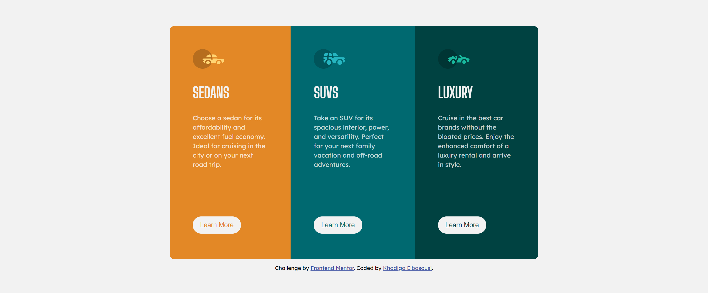

# Frontend Mentor - 3-column preview card component solution

This is a solution to the [3-column preview card component challenge on Frontend Mentor](https://www.frontendmentor.io/challenges/3column-preview-card-component-pH92eAR2-). Frontend Mentor challenges help you improve your coding skills by building realistic projects. 

## Table of contents

- [Overview](#overview)
  - [The challenge](#the-challenge)
  - [Screenshot](#screenshot)
- [My process](#my-process)
  - [Built with](#built-with)
  - [What I learned](#what-i-learned)
  - [Useful resources](#useful-resources)
- [Author](#author)
- [Acknowledgments](#acknowledgments)


## Overview

### The challenge

Users should be able to:

- View the optimal layout depending on their device's screen size
- See hover states for interactive elements

### Screenshot



## My process

### Built with

- Semantic HTML5 markup
- CSS custom properties
- Flexbox

### What I learned

I learned from this project how to use Hover to change the shape of the buttons when being pointed to.

```css
button:hover{
    color: hsla(0, 0%, 100%, 0.75);
    border:  solid hsla(0, 0%, 100%, 0.75);;
}
```

### Useful resources

- [Example resource 1](https://css-tricks.com/a-complete-guide-to-css-media-queries/) - This is an amazing article which helped me in understanding how to use media queries.I'd recommend it to anyone still learning this concept.

## Author

Khadiga Elbasousi

## Acknowledgments

Thanks to the course I took with Udacity about HTML and CSS I was able to do this project.# Three-column-card
